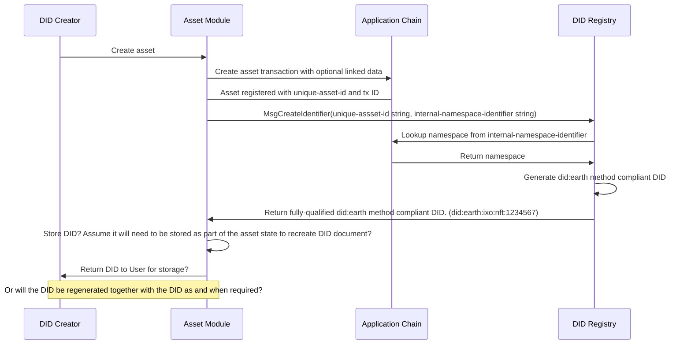
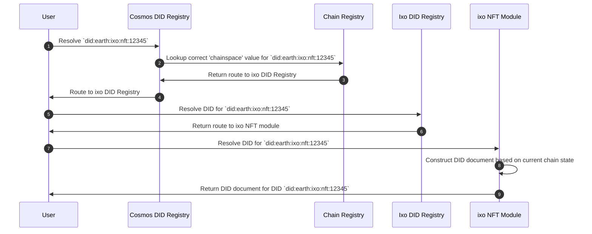
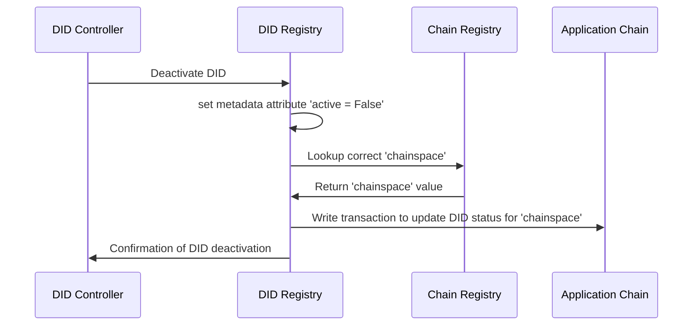

# DID Method Specification - did:earth

## Abstract
Interchain Identifiers (IIDs) are a family of Decentralized Identifier methods which are purpose-designed to identify, refer to, and interact with digital assets within blockchain namespaces.

The IID specification builds on the Decentralized Identifier (DID) core specification from the World Wide Web Consortium (W3C) [[1]](#ref1). IIDs are fully conformant DIDs and therefore are DIDs. IID Documents are DID documents. Unlike DIDs, IIDs only reference on-chain assets—which we will refer to as tokens—but should be taken as any type of tokens, such as NFTs, fungible tokens, tokenized namespace records, or other on-chain assets.

By restricting IIDs to on-chain assets, we create a new class of identifier uniquely suited to the requirements of tokens and other chain-native components. IID methods can be developed for any compatible blockchain, making them suitable for interoperable representations of tokens (and the cryptography that secures those tokens) regardless of the underlying chain.

IIDs also introduce a few new features—conformant extensions to the DID Core specification—that provide for privacy-respecting options for the full range of expected token functionality, including Linked Resources, On-chain Service Endpoints, and Accorded Rights.

DID Methods which conform to the IID specification resolve to a DID document representing how to securely interact with a uniquely identified digital asset, within a unique blockchain namespace. Because IIDs are DIDs, software applications that are conformant with the W3C specification will be able to inter-operate with IIDs and IID documents, although some IID-specific features may require additional tooling.

did:earth DIDs are IIDs intended identify assets on cosmos application chains.

### DID Method Name
The namestring that shall identify this DID `method-name` is: `earth`.

An example `did:earth` method identifier is `did:earth:version:chainspace:namespace:unique-id`.

A DID that uses this method MUST begin with the following prefix `did:earth`. The prefix string MUST be in lowercase. The remainder of the DID after the prefix, is specified below:

#### Method Specific Identifier
The `did:earth` method-specific identifier (`method-specific-id`) is made up of a `version`, `chainspace` and a `namespace` component.

The `version` is defined as an integer that identifies a specific version of `did:earth` method operations such as 
create, read, update, and deactivate. The version number increases by one for each breaking change in the specification, enabling future enhancements to the specification while retaining backwards compatibility for long-lived identifiers. 

Implementers SHOULD maintain compatibility with all existing versions likely to be in use. For application chains, this means supporting the version that was current when the chain first adopted did:earth functionality, as well as all subsequent versions if possible. DID resolvers--which may be off-chain--will likely need to maintain support for all versions until convinced there are no outstanding DIDs using that version. Software which is asked to handled a version # that it does not support MUST return an error.

The `chainspace` is defined as a string that identifies a specific Cosmos blockchain (e.g. "ixo", "regen", "cosmos") where the DID reference is stored.

The `namespace` is an alphanumeric string that identifies a distinct namespace managed by the application chain's name server module. These namespaces, e.g., "nft", "bank", "staking", identify where the on-chain asset is maintained on that particular chain. It is used to route incoming resolution requests to the correct asset module.

To support `did:earth`, any Cosmos application chain MAY add an entry in the [Cosmos Chain Registry](https://github.com/cosmos/chain-registry). Each network, such as "mainnet" or "testnet" are independent entries in the registry with unique chain names and separate chain definition files, called`chain.json`. Each `chain.json` MUST provide all of the information required for connecting to that network. The `chain_name` MUST be used to as the `chainspace` string in the `did:earth` method. The `chain-id` contained in the `chain.json` will be used by resolvers to identify the correct Cosmos blockchain network to connect to.

The [Cosmos Chain Registry](https://github.com/cosmos/chain-registry) will be used as the source of valid `chainspace` values and can be programmatically queried via an [API](https://registry.cosmos.directory/). 

> Every Cosmos blockchain consist of a genesis file that defines the operational parameters including the `chain-name`. The `chain-id` refers to a specific `chainspace` blockchain and MUST be a unique (up to 50 characters), alphanumeric value across all Cosmos blockchains.

> For each Cosmos blockchain there will be an entry in the [Cosmos Chain Registry](https://github.com/cosmos/chain-registry) that includes a file called `chain.json`. Each `chain.json` file will have two entries, one representing the `mainnet` and another representing the `testnet` of the Cosmos blockhain `chainspace`. The `chain_name` entry of either the `mainnet` or `testnet` can be used to represent the `chainspace` in the earth DID method. The `chain-id` contained in the `chain.json` will be extracted for each `chain-name` to identify the correct Cosmos blockchain network to connect to. 

>Two cryptogaphic suites will be available for the earth DID method, namely `Secp256k1` and `Ed25519`.

The `did:earth` method support offline creation of DIDs.
An offline generated `did:earth` DID must be unique by having the `unique-id` component be derived from the initial public key of the DID. 

> For an `Ed25519` public key, the first 16 bytes of the base-58 representation of the 256-bit public key is used to generate the unique-id.
> multibase(multicodec(public_key))

#### did:earth method syntax
```abnf
earth-did          = "did:earth:" chainspace ":" namespace ":" version ":"  unique-id
version            = 1*version-char
version-char       = DIGIT
chainspace         = 1*50chainspace-char
chainspace-char    = ALPHA / DIGIT / (ALPHA "-") / (DIGIT "-")
namespace          = 1*50idchar 
unique-id          = *( *idchar ":" ) 1*idchar
id-char            = ALPHA / DIGIT / (ALPHA "-") / (DIGIT "-")

```

#### Examples of `did:earth` identifiers

A DID written to the ixo Impact Hub Cosmos Blockchain network "NFT" `namespace`:

```abnf
did:earth:1:impacthub:nft:7Tqg6BwSSWapxgUDm9KKgg
```

A DID written to the Regen Cosmos Blockchain network "NFT" `namespace`:

```abnf
did:earth:1:regen:ecocredit:1Kpg3KJPOIarthPWf8HHyy
```

A DID written to the Regen `Testnet` Cosmos Blockchain network "NFT" `namespace`:

```abnf
did:earth:1:regentest:ecocredit:1Kpg3KJPOIarthPWf8HHyy
```

A DID written to the ixo Impact Hub Cosmos Blockchain network "NFT" `namespace` retrieving a specific IID Linked Resource `path`:

```abnf
did:earth:1:ixo:nft:7Tqg6BwSSWapxgUDm9KKgg/myresource
```

A DID written to the ixo Cosmos Blockchain network "NFT" `namespace` referencing a specific IID Linked Resource `fragment`:

```abnf
did:earth:1:ixo:nft:7Tqg6BwSSWapxgUDm9KKgg#myresource
```

### DID Documents
A DID document associated with an earth DID is a set of data describing a DID subject. The [representation of a DID document when requested for production](https://www.w3.org/TR/did-core/#representations) MUST meet the DID Core specifications.

### Linked Resources

The `linkedResource` property provides a privacy-enabled way to attach digital resources to an on-chain asset. This is an optional property which may contain one or more resource descriptors in an array. This property provides the metadata required for accessing and using the specified resource, such as the type of resource, a proof to verify the resource, and a service endpoint for requesting and retrieving the resource.

Resources may be provided in-line or by secure reference. Inline resources are appropriate only for use cases that need to directly include the resource in the IID Document. In many cases, this is a privacy problem. However, for some use cases, resources must be specified for on-chain execution, which justifies the added bytes and potential disclosure risk. The resource descriptor provides for a flexible representation of various mime types, compression, and encoding, as required for the use.

> Note: The below para could be moved to security considerations I think

Resources may be secured by specifying a `proofType` of hash or hashgraph. A hashgraph uses a merkle tree of hashes for external content associated with this asset. A resource descriptor of this type obscures both the type and the number of such resources, while allowing each such resource to be verifiably linked to the asset. It also provides for privacy-respecting verification of complete disclosure. Anyone who needs to prove they have all of the linked resources can compare their own hash graph of resources with the value stored in the IID Document. Note this anti-censorship technique requires a verifier to discover the type and nature of those resources on their own.

Proposed properties for resource descriptors in the `LinkedResource` property:
```javascript
{
	"linkedResource": [{

		"path"(optional): // IID Resource path for this resource in the asset namespace, e.g., /myResource.png

			"id"(optional): // IID Reference ID for this resource, e.g., #myResource.png

			"rel"(optional): // the relationship of this resource to the IID Asset

			"type": "nft:ResourceDescriptor", // The JSON-LD type of this resource

		"proof": [ // an array of proofs, any of which may be used
			{
				"type"(optional): "hash" | "hashgraph" | "hashset" // the form of proof used to verify the resource as authentic
				"stage"(optional): "raw" | "compressed" | "encrypted" | "encoded" // the 
				"value"(optional): hash | hashgraph | hashset, // the actual proof for this particular resource
			}
		],
		"resourceFormat": media type, // the IANA media-type of the linked resource

		"compression"(optional): "gzip" | "none", // the compression (performed on the raw resource) of an inline resource

		"encryption": [open ended
			for arbitrary extensibility
		], // the encryption technique applied after compression and before encoding

		"encoding"(optional): "native" | "multibase" | "string", // the encoding (after compression and encryption) of an inline resource; "native" means the inline resource is native JSON-LD with neither compression nor encryption

		"endpoint"(optional): url, // a URL at which this resource can be retrieved before decrypting and decrompressing

		"resource"(optional): "..."
		a representation of the resource
		for inline
		distribution,
		encoded as per "encoding"
    }]
}
```

#### Elements for a W3C DID Core Compliant DID document Representation

1. **`@context`** (mandatory): The serialized value of @context MUST be the JSON String https://www.w3.org/ns/did/v1, or a JSON Array where the first item is the JSON String https://www.w3.org/ns/did/v1 and the subsequent items are serialized according to the JSON representation production rules.
2. **`id`**: Target DID as base58-encoded string for 16 or 32 byte DID value with earth DID Method prefix `did:earth:<chainspace>:<namespace>:`.
3. **`controller`** (optional): A list of fully qualified DID strings or one string. Contains one or more DIDs who can update this DIDdoc. All DIDs must exist.
4. **`verificationMethod`** (optional): A list of Verification Methods
5. **`authentication`** (optional): A list of strings with key aliases or IDs
6. **`assertionMethod`** (optional): A list of strings with key aliases or IDs
7. **`capabilityInvocation`** (optional): A list of strings with key aliases or IDs
8. **`capabilityDelegation`** (optional): A list of strings with key aliases or IDs
9. **`keyAgreement`** (optional): A list of strings with key aliases or IDs
10. **`service`** (optional): A set of Service Endpoint maps
11. **`alsoKnownAs`** (optional): A list of strings. A DID subject can have multiple identifiers for different purposes, or at different times. The assertion that two or more DIDs refer to the same DID subject can be made using the `alsoKnownAs` property.


```
Must be JSON-LD
https://w3c.github.io/did-core/#json-ld

The DID document, DID document data structures, and representation-specific entries map MUST be serialized to the JSON-LD representation according to the JSON representation production rules as defined in § 6.2 JSON.

In addition to using the JSON representation production rules, JSON-LD production MUST include the representation-specific @context entry. The serialized value of @context MUST be the JSON String https://www.w3.org/ns/did/v1, or a JSON Array where the first item is the JSON String https://www.w3.org/ns/did/v1 and the subsequent items are serialized according to the JSON representation production rules.
```

#### Additonal elements specific to the did:earth method DID document representation
13. **`linkedResource`** (optional): is a new IID document property for specifying how to verify, and optionally retrieve, any and all resources necessary for the proper functioning of the on-chain asset. Like email attachments, LinkedResources provide for attaching arbitrary media to an onchain asset.
14. **`transclude`** (optional): is a new IID document property for specifying where in an IID document to transclude a linked resource. If present, the value of this property MUST be one (or an array of more than one) Linked Resources that eventually dereferences to a raw JSON-LD object. The properties of that JSON-LD object will be injected into the current IID document, replacing the transclude property entirely. The properties of the transcluded JSON-LD MUST be transformed to their absolute representation using the object's `@context` value prior to transclusion. The associated linked resources MUST have a `rel` value of "extension" and a `mediaType` value of "application/ld-json"
15. **`extension`** (optional): a type of Linked Resource. A JSON-LD extension of the current document. The RDF statements in the extension are to be included in the current IID document, where specified by a "transclude" property. For example, additional service endpoint definitions may be added in a linked resource. These endpoints can be verified as being associated with the IID. But only by those parties who secure the definitions through other privacy respecting mechanisms. This property standardizes how to verifiably move arbitrary RDF statements outside of the IID document context, to provide additional security and privacy.
16. **`executableRight`** (optional): a type of Linked Resource. This resource is a machine-executable capability that can be invoked by the IID owner or its delegate, using cryptographic materials defined elsewhere in the IID document Verification Methods property.
17. **`assertion`** (optional): a rel value for a Linked Resource. Verifiable credentials, verified claims, claim tokens as described in NFT-RFC-008. This allows arbitrary, yet verifiable attestations to be made either about the asset or about the resources defined by IID references. The attributes represented in these claims can be retrieved through the token interface using a Query by Example. (graph query) mechanism.
18. **`rel`** (optional): a property of Linked Resource. Defines the relationship of this resource to the IID asset. Known values include:
     1. "evidence" -- The resource is evidence for the creation of the asset.
     2. "encodedRepresentation" -- The resource is a binary representation of the asset, interpretable by compatible software to display or interact with.
     3. "visualRepresentation" -- The resource is a visual representation of the asset
19. **`accordedRight`** (optional): a type of relationship to a Linked Resource. Specifies the rights accorded to the IID owner, or its deligate, which may be executed by physical-world institutions or processes. Such as a digital driver's license according certain rights to drive, or a theater ticket according access to a show. The representation framework for such rights must be non-prescriptive, including both plain text statements of rights, e.g., "The controller of this IID is entitled to ...", or more rigorous and computationally evaluatable RDF statements, which might describe in great detail a range of benefits that accompany the basic rights of the token.
20. **`displayName`** (optional): a property of Linked Resources that provide a brief textual label for display.
21. **`displayDescription`** (optional): a property of Linked Resources that provide a longer text phrase for displaying additional detail about the asset.
22. **`displayIcon`** (optional): a property of Linked Resources that provide a URL for an image asset to use when displaying the asset.

#### State format for DID documents on ledger

**Consider the following example minimum DID document from DID Core:**
##### EXAMPLE 1: A minimal DID document (JSON-LD)

```json
{

"@context": "https://www.w3.org/ns/did/v1",

"id": "did:example:abc123",

"authentication": [{

  "id": "did:example:abc123#keys-1",

  "type": "Ed25519VerificationKey2020",

  "controller": "did:example:abc123",

  "publicKeyMultibase": "zH3C2AVvLMv6gmMNam3uVAjZpfkcJCwDwnZn6z3wXmqPV"

  }]

}
```

This minimal DID document is fully conformant with the specification and includes a single verification relationship and method: how to
authenticate on behalf of the DID Subject.

It is useful to note that Verification Methods can be anything\*, e.g., ed25519, secp256k, etc.

**An equivalent example of minimal IID document would be:**

##### EXAMPLE 2: A minimal IID document (JSON-LD)

```json
{

"@context": ["https://www.w3.org/ns/did/v1",

  "https://internft.org/ns/iid/v1"],
> [replace with the correct w3id/org permalink]
"https://internft.org/ns/iid/v1"]
"id": "did::earth:1:impacthub:nft:abc123",

"authentication": [{

  "id": "did:earth:1:impacthub:nft:abc123i#keys-1",

  "type": "Ed25519VerificationKey2020",

  "controller": "did:earth:1:impacthub:nft:abc123",

  "publicKeyMultibase": "zH3C2AVvLMv6gmMNam3uVAjZpfkcJCwDwnZn6z3wXmqPV"

  }]

}
```

##### EXAMPLE 3: A minimal, privacy-preserving IID document (JSON-LD)

```json
{

  "@context": ["https://www.w3.org/ns/did/v1",

    "https://internft.org/ns/iid/v1"],

  "id": "did:earth:1:impacthub:nft:abc123",

  "authentication": [{

    "id": "did::earth:1:impacthub:nft:abc123i#keys-1",

    "type": "Ed25519VerificationKey2020",

    "controller": "did:earth:1:impacthub:nft:abc123",

    "publicKeyMultibase": "zH3C2AVvLMv6gmMNam3uVAjZpfkcJCwDwnZn6z3wXmqPV"

  }],

  "service": [{

    "id":"did:earth:1:impacthub:nft:abc123#mediator",

    "type": "polymorphicMediator2021",

    "serviceEndpoint": "http://8zd335ae47dp89pd.onion/iid/mediator/ did:example:abc123"

  }],

"linkedResource" : [{

    "id": "did:earth:1:impacthub:abc123#resourceHashgraph",

    "path": "did:earth:1:impacthub:nft:abc123/resourceHashgraph",

    "type": "hashgraph",
  
    "proof": "afybeiemxf5abjwjbikoz4mcb3a3dla6ual3jsgpdr4cjr3oz",

    "endpoint" : "did:earth:1:impacthub:nft:abc123?service=mediator"

  }]

}
```

##### EXAMPLE 4: A privacy-preserving IID document with zCap support (JSON-LD)
```json
{

  "@context": ["https://www.w3.org/ns/did/v1",
    "https://internft.org/ns/iid/v1"],
  "id": "did:earth:1:impacthub:nft:abc123",

  "verificationMethod": [{
    "id": "did:earth:1:impacthub:nft:abc123#keys-1",
    "type": "Ed25519VerificationKey2020",
    "controller": "did:earth:1:impacthub:nft:abc123",
    "publicKeyMultibase": "zH3C2AVvLMv6gmMNam3uVAjZpfkcJCwDwnZn6z3wXmqPV"
  }],

  "authentication": "did:earth:1:impacthub:nft:abc123#keys-1",
  "capabilityDelegation" : "did:earth:1:impacthub:nft:abc123#keys-1",
  "capabilityInvocation" : "did:earth:1:impacthub:nft:abc123#keys-1",

  "service": [{
    "id":"did:earth:1:impacthub:nft:abc123#mediator",
    "type": "polymorphicMediator2021",
    "serviceEndpoint": "http://8zd335ae47dp89pd.onion/iid/mediator/did:earth:1:impacthub:nft:abc123"
  }],

"linkedResource" : [{
    "id": "did:earth:1:impacthub:nft:abc123#resourceHashgraph",
    "path": "did:earth:1:impacthub:nft:abc123/resourceHashgraph",
    "type": "hashgraph",
    "rel":"attachments",
    "proof": "afybeiemxf5abjwjbikoz4mcb3a3dla6ual3jsgpdr4cjr3oz",
    "endpoint" : "did:earth:1:impacthub:nft:abc123?service=mediator"
  }]

}
```

#### DID document metadata

##### Example of DID document metadata

#### Verification method

Verification methods are used to define how to authenticate / authorise interactions with a DID subject or delegates. Verification method is an OPTIONAL property.

1. **`id`** (string): A string with format `did:earth:impacthub:<chainspace>:<namespace>#<key-alias>`
2. **`controller`**: A string with fully qualified DID. DID must exist.
3. **`type`** (string)
4. **`publicKeyJwk`** (`map[string,string]`, optional): A map representing a JSON Web Key that conforms to [RFC7517](https://tools.ietf.org/html/rfc7517). See definition of `publicKeyJwk` for additional constraints.
5. **`publicKeyMultibase`** (optional): A base58-encoded string that conforms to a [MULTIBASE](https://datatracker.ietf.org/doc/html/draft-multiformats-multibase-03)
encoded public key.

**Note**: Verification method cannot contain both `publicKeyJwk` and `publicKeyMultibase` but must contain at least one of them.

##### Example of Verification method in a DID document

```jsonc
{
  "id": "did:earth:1:impacthub:nft:abc123#key-0",
  "type": "JsonWebKey2020",
  "controller": "did:earth:1:impacthub:nft:abc123",
  "publicKeyJwk": {
    "kty": "OKP",
    // external (property name)
    "crv": "Ed25519",
    // external (property name)
    "x": "VCpo2LMLhn6iWku8MKvSLg2ZAoC-nlOyPVQaO3FxVeQ"
    // external (property name)
  }
}
```
#### Service
Services can be defined in a DID document to express means of communicating with the DID subject or associated entities.

1. **`id`** (string): The value of the `id` property for a Service MUST be a URI conforming to [RFC3986](https://www.rfc-editor.org/rfc/rfc3986). A conforming producer MUST NOT produce multiple service entries with the same ID. A conforming consumer MUST produce an error if it detects multiple service entries with the same ID. The ID defines a node in the JSON-LD graph of the DID document, using either `<did-of-this-document>#<service-alias>` or `#<service-alias>`.
2. **`type`** (string): The service type and its associated properties SHOULD be registered in the [DID Specification Registries](https://www.w3.org/TR/did-spec-registries/)
3. **`serviceEndpoint`** (strings): A string that conforms to the rules of [RFC3986](https://www.rfc-editor.org/rfc/rfc3986) for URIs, a map, or a set composed of a one or more strings that conform to the rules of
[RFC3986](https://www.rfc-editor.org/rfc/rfc3986) for URIs and/or maps.

##### Example of Service in a DID document

```jsonc
{
  "id":"did:earth:1:impacthub:nft:abc123#linked-domain",
  "type": "LinkedDomains",
  "serviceEndpoint": "https://bar.example.com"
}
```

### DID transaction operations
DID and associated documents are managed by a Cosmos-SDK module that uses the gRPC communication protocol. See [method specification](https://hackmd.io/1Nh-r80_SiyKvWzotvkTSQ) for details on how create, read, update and delete (CRUD) operations are handled in the Cosmos IID module.

#### Create DID (Register)


The objective of the IID method is to allow any application developer to include the `did:earth` method in Cosmos modules. Most modules (e.g. NFT, bank, tx) already keep state and events related to assets created and managed by the module. IIDs can be created by any module as an additional capability to enrich assets and related information that exist on-chain and off-chain.

Any developer is free to implement the 'did:earth' method as a DID and on-chain asset enrichment capability inside any Cosmos module.
DID records created by various Cosmos module developers will be stored in an internal DID registry of the module as part of the module state. DID records can change state from trigger events by the linked asset.

Below is an example of create operation with the IID interface used by did:earth.

This operation creates a new DID using the did:earth method along with associated DID document representation.

To create and publish a local `chainspace` DID document use the message: 

```golang
MsgCreateIdentifier(unique-id string, namespace string)
```
To create and publish a remote `chainspace` DID document use the message: 

```golang
MsgCreateIdentifier(unique-id string, namespace string, chainspace string)
```

If the input DID is not a valid DID for the Earth method, or if the DID already exists on-chain, the message returns an error.

- **`unique-id`**: `MsgCreateIdentifier` unique asset ID inside a Cosmos module.
- **`namespace`**: the relevant module that control the associated DID on-chain asset.
- **`chainspace`**: the relevant Cosmos blockchain that the DID should be registered on.
- **`controller, verificationMethod, authentication, assertionMethod, capabilityInvocation, capabilityDelegation, keyAgreement, service, alsoKnownAs, context`**: Optional parameters in accordance with DID Core specification properties.

##### Client request format for create DID
```jsonc
WriteRequest (MsgCreateIdentifier(unique-id string, namespace string)
```

##### Example of a create DID client request
```jsonc
WriteRequest{
        "data": MsgCreateIdentifier {
                "id": "1234567",
                "namespace": "nft"
            }
}
```

#### Read DID (Resolve and Verify)
Example flow for `did:earth:ixo:nft:12345`, an asset hosted by the NFT module on the ixo application chain.


To resolve did:earth method DID documents, the `QueryIdentifierDocument` operation fetches a response from the ledger. The integrity of the DID documents stored on the ledger is guaranteed by the underlying Cosmos blockchain protocol. DID resolution requests can be sent to the gRPC IID resolver interface for a node by passing the fully-qualified DID. 

A DID can be resolved using the gRPC message:
```golang
QueryIdentifierDocument(id string)
```
The operation CAN be executed by anyone and is publicly available.

- **`id`**: `QueryIdentifierDocument` should be a fully qualified DID of type `did:earth:<chainspace>:<namespace>`. It MUST be the DID that is to be resolved. Allowed `chainspace` and `namespace` values are available in the [Cosmos Chain Registry](https://github.com/cosmos/chain-registry)
- **`metadata`**: Contains DID document metadata? `created`, `updated`, `valid`, `versionId`

The IID resolver is a public facing interface and will be exposed by installing the IID module in the Cosmos blockchain. The IID resolver will resolve down to the `namespace` to query for the DID document. This assume that Cosmos module developers using the `did:earth` method will need to implement a DID resolver internal to the module to fetch stored DID documents.

The operation MUST return the DID document and metadata if it exist in the Cosmos blockchain module.

##### Client request format to resolve a DID to its DID document
```jsonc
WriteRequest QueryIdentifierDocument(id string)
```
##### Example of DID resolution to DID document client request
```jsonc
WriteRequest{
        "data": QueryIdentifierDocument {
                "id": "did:earth:impacthub:nft:1234567"
        }
}
```
#### Update DID
This operation allow updates to DID documents by the controller(s).

Please note that the DID will remain the same, but the contents of the DID document could change, e.g., by including a new verification key or adding service endpoints.

A DID can be updated using the gRPC message:
```golang
MsgUpdateIidDocument(id string, controller string, identifiers list, verificationMethods list, verificationRelationships list, service service, linkedResources list, accordedRights list)
```
The operation MUST be executed by an authorized controller of the DID.

- **`id`**: `MsgUpdateIidDocument` should be a fully qualified DID of type `did:earth:<chainspace>:<namespace>`. It MUST be the DID that is to be deleted. Allowed `chainspace` and `namespace` values are available in the [Cosmos Chain Registry](https://github.com/cosmos/chain-registry)
- **`controller`**: should be a fully qualified DID of type `did:earth:<chainspace>:<namespace>`.
- **`identifiers, verificationMethods, verificationRelationships, service, linkedResources, accordedRights`**: Optional parameters in accordance with DID Core and IID specification properties.

The operation MUST update the DID document and metadata. The operation is not reversible.

##### Client request format to update a DID document
```jsonc
WriteRequest MsgUpdateIidDocument(id string, controller string, identifiers list, verificationMethods list, verificationRelationships list, service service, linkedResources list, accordedRights list)
```
##### Example of update DID document client request
```jsonc
WriteRequest{
        "data": MsgUpdateIidDocument {
                "id": "did:earth:impacthub:1234567",
        "controller": "did:earth:impacthub:1234567"
        "identifiers": [],
        "verificationMethods": [],
        "verificationRelationships": [],
        "service": service,
        "linkedResources": [],
        "accordedRights": []
        }
}
```

#### Transfer DID

```mermaid
sequenceDiagram
autonumber 
participant User
participant Web Browser
participant NFT DAPP
participant Wallet
participant Cosmos DID Registry (running on Cosmos Hub)
participant Chain Registry API
participant ixo DID Registry
participant ixo NFT Module

User->>Web Browser: Go get an NFT
Web Browser->>NFT DAPP: Browse NFTs
NFT DAPP-->>Web Browser: Show NFTs
Web Browser-->>User: Display NFTs
User->>Web Browser: Buy NFT
Web Browser->>NFT DAPP: Buy NFT
NFT DAPP->>Cosmos DID Registry (running on Cosmos Hub): Resolve NFT IID
Cosmos DID Registry (running on Cosmos Hub)-->>NFT DAPP: Linked Resource Reference
NFT DAPP->>Chain Registry API: Get chain definition
Chain Registry API-->>NFT DAPP: Return chain.json
NFT DAPP->>ixo DID Registry: Resolve NFT IID
ixo DID Registry-->>NFT DAPP: Asset Module Reference
NFT DAPP->>ixo NFT Module: Resolve NFT IID
ixo NFT Module-->>NFT DAPP: Return DID document
NFT DAPP->>NFT DAPP: Generate transfer transaction
NFT DAPP->>Web Browser: Request tx signature
Web Browser->>Wallet: Request tx signature
Wallet->>User: Display Transaction Request
User-->>Wallet: Approve Transaction
Wallet->>Wallet: Sign Transaction
Wallet-->>Web Browser: Signed Transaction
Web Browser-->>NFT DAPP: Transfer signed transaction
NFT DAPP->>ixo NFT Module: Transfer Ownership
ixo NFT Module->>ixo NFT Module: Update NFT owner on chain
ixo NFT Module-->>NFT DAPP: Transaction result
NFT DAPP-->>Web Browser: Transaction success
Web Browser-->>User: Display NFT transfer success


```

#### Revoke DID
This operation deactivates DID records using the did:earth method.

#### Deactivate DID



A DID can be deactivated using the gRPC message:
The operation MUST be executed by an authorized controller of the DID.

```golang
MsgDeactivateIdentifier(id string, Controller string)
```

- **`id`**: `MsgDeactivateIdentifier` should be a fully qualified DID of type `did:earth:<chainspace>:<namespace>`. It MUST be the DID that is to be deactivated. Allowed `chainspace` and `namespace` values are available in the [Cosmos Chain Registry](https://github.com/cosmos/chain-registry)
- **`controller`**: should be a fully qualified DID of type `did:earth:<chainspace>:<namespace>`.

The operation MUST update the DID document metadata and set the Active value to False. The operation is not reversible.

##### Client request format to deactivate a DID
```jsonc
WriteRequest MsgDeactivateIdentifier(id string, Controller string)
```

A DID can be deactivated using the gRPC message:
The operation MUST be executed by an authorized controller of the DID.
```golang
MsgDeactivateIdentifier(id string, Controller string)
```
##### Example of deactivate DID client request
```jsonc
WriteRequest{
        "data": MsgDeactivateIdentifier {
                "id": "did:earth:impacthub:1234567",
        "controller": "did:earth:impacthub:1234567"
        }
}
```


### Security Considerations

### Privacy Considerations

#### IIDs are designed to represent on-chain Assets

IIDs, e.g., did:earth:ixo:nft:1:abc are designed to represent on-chain assets, as such the identifier itself is never used to refer to real-world objects like people, with associated privacy requirements.

#### IID references may refer to people or orgainsations

IID references, e.g., did:earth:ixo:nft:1:abc#creator may in fact be used to refer to real people and organizations. As such, care must be taken to ensure that any associated personal data be managed off chain with appropriate privacy mechanisms such as the ability to remove the data from public disclosure.

#### Linked Resources are designed to be privacy-agile

IID references specified as Linked Resources offer several privacy-agile ways to associate the on-chain asset with arbitrary resources, providing a way for did:earth:ixo:nft:1:abc#creator to refer to an off-chain data store with the sensitive data. For example, an NFT's creator could be specified by a link and a hash to a Verifiable Credential (or a simple JSON file) that states the creator's name. Storing that name on-chain would create a regulatory problem. Linked Resources allow the information to be shared while ensuring the ability to honor requests for deletion.

##### Example of a linked resource that references its creator 

```javascript
"linkedResource" : {
  "id" : "#creator",
  "path": "/creator",
  "rel":"dc:creator",
  "type" : "iid:ResourceDescriptor",
  "proof" : [{
     "type": "hash",
     "stage": "encoded",
     "value" : "bafybeigdyrzt5sfp7udm7hu76uh7y26nf3efuylqabf3oclgtqy55fbzdi"}],
   "resourceFormat" : "application/did+ld+json",
   "compression" : "none",
   "endpoint": "https://earthprogram.directory?listing=did:earth:ixo:nft:1:abc123#owner"
}
```

#### Hash based Linked Resource

#### Hash Graph based Linked Resource

#### Hash Set based Linked Resource
The `linkedResource` property provides a privacy-enabled way to attach
digital resources to an on-chain asset. This is an optional property which
may contain one or more resource descriptors in array. This property provides the metadata required for accessing and using the specified resource, such as the type of resource, a proof to verify the resource, and a service endpoint for requesting and retrieving the resource.

Resources may be provided in-line or by secure reference. Inline resources are appropriate only for use cases that need to directly include the resource in the IID Document. In many cases, this is a privacy problem. However, for some use cases, resources must be specified for on-chain execution, which justifies the added bytes and potential disclosure risk. The resource descriptor provides for a flexible representation of various mime types, compression, and encoding, as required for the use.

This approach allows token owners to manage privacy in three key ways:

1.  Avoids posting potentially sensitive information on-chain in an unavoidably public and irrevocable manner.
2.  Provides a service endpoint that can apply appropriate privacy and security checks before revealing information.
3.  The hashgraph resource descriptor type obscures not only the content of the linked resource, but also the quantity of resource objects.

Resources may be secured by specifying a `proofType` of hash or hashgraph. A hashgraph uses a merkle tree of hashes for external content associated with this asset. A resource descriptor of this type obscures both the type and the number of such resources, while allowing each such resource to be verifiably linked to the asset. It also provides for privacy-respecting verification of complete disclosure. Anyone who needs to prove they have all of the linked resources can compare their own hash graph of resources with the value stored in the IID Document. Note this anti-censorship technique requires a verifier to discover the type and nature of those resources on their own.
                    
## References
<a name="ref1">[1]</a> Decentralized Identifiers (DIDs) v1.0. World Wide Web Consortium.
Online at
[[https://www.w3.org/TR/did-core/]](https://www.w3.org/TR/did-core/).
Accessed February 15, 2021.
